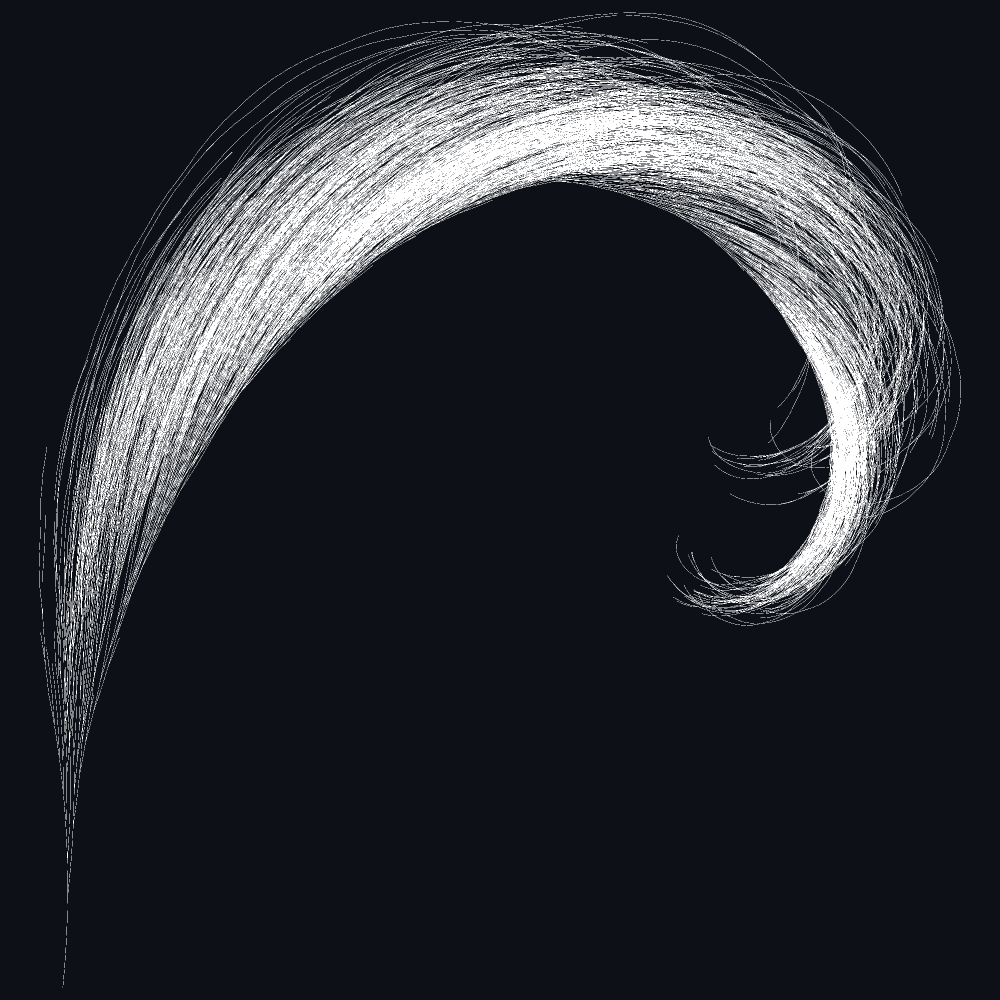

# Hailstone


A configurable visualization of the Collatz Conjecture also known as a "Hailstone Sequence" using Python and C++.

## Installation

Download and extract one of the releases under [Releases](https://github.com/a22Dv/Hailstone/releases/). 

After doing so, open the terminal in the path you extracted the `.zip ` file and run:
```
python -m venv venv; venv/scripts/activate; pip install -r requirements.txt; python collatz_main.py 
```
This creates a virtual environment in the path set, activates it, then installs the requirements there, and finally runs the script.

## How to use

After running `python collatz_main.py`, you'll be greeted with:
```
Enter Range [2 -> N]: 
```
Just enter any range, above 2 and up to any N.
>[!WARNING]
> N is largely limited by the capacity of a `uint64`. So the program will crash with high enough N if it overflows. I haven't checked what numbers trigger this, but this is unlikely to happen for the first 10s of millions.

Wait until the program finishes until it displays an output image, which you can then choose to save or not. Saving it will save the final image in an `images/` directory in the same path you ran the script.

You can edit the parameters in the accompanied `config.yaml` file. Details about each parameter are commented out above the options in the file.

### Sample Output


### Disclaimer

>[!CAUTION]
> This program is RAM-intensive. It is NOT recommended to go beyond a range of 1,000,000 as going into the millions WILL cause an `out of memory` error, or in the worst-case scenario outright crash your device. Of course, the exact limit will depend on your system specifications.

## License

This project is licensed under the MIT License - see LICENSE for more details.

## Author

a22Dv - a22dev.gl@gmail.com